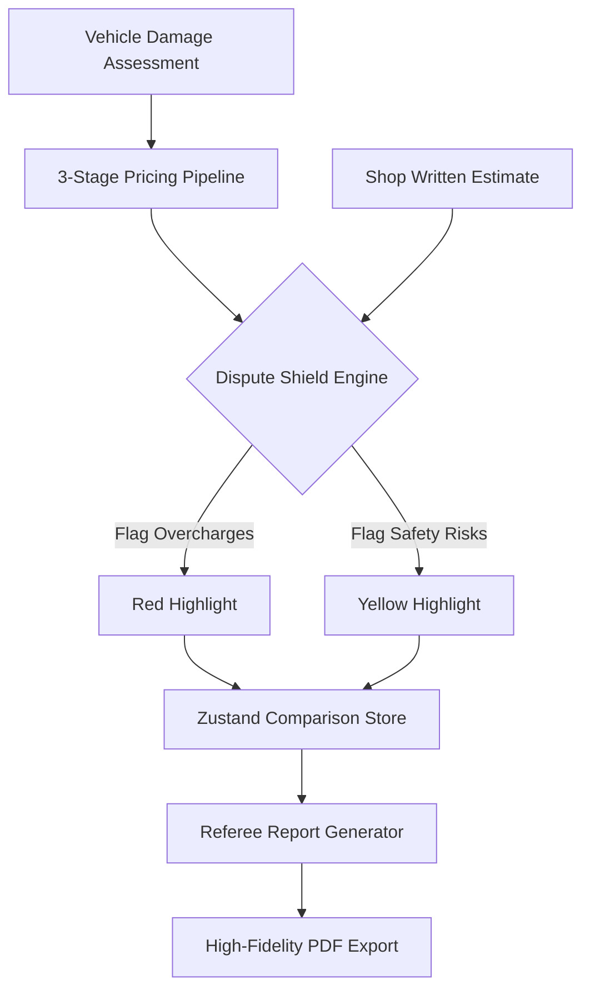

# RepairSync: Dispute Shield & Referee Reporting Specification

## Overview
RepairSync acts as a **Neutral AI Referee** in the auto repair ecosystem. The **Dispute Shield™** and **Referee Reporting** systems are the core manifestations of this "Truth Layer," providing objective evidence to resolve discrepancies between shop estimates and actual market reality.

---

## 1. Architecture: The Truth Layer Flow



---

## 2. The Dispute Shield™ Engine

The Dispute Shield compares two disparate data sources:
1. **Source A (Shop Estimate)**: The manual estimate provided by the repair facility.
2. **Source B (Referee Reality)**: The AI-driven assessment derived from VIN-specific parts pricing and MOTORS-standard labor times.

### Discrepancy Logic
| Condition | ID Color | Classification | Philosophy |
| :--- | :--- | :--- | :--- |
| `Shop Price > AI Price * 1.1` | **Red** | **Overcharge** | Protecting the insurer/vehicle owner from market-above pricing. |
| `Item Missing from Shop Est.` | **Yellow** | **Safety Risk** | Ensuring critical procedures (ADAS, Calibrations) aren't skipped. |
| `Price Delta < 5%` | **Emerald** | **Agreed** | Validating fair market pricing. |

---

## 3. Referee Reporting (PDF Specification)

The **Referee Report** is a clinical-grade document designed to be the "final word" in an indemnity dispute.

### 3.1 PDF Layout Components
- **Identity Header**: Includes a unique `REPORT #RS-XXXXXX` ID and a "Neutrality Certified" watermark.
- **Vehicle IQ Section**: Decoded VIN data and overall severity matrix.
- **Dispute Ledger**: A detailed table contrasting Shop vs. AI pricing with status badges.
- **Visual Evidence Grid**: High-contrast photos of impact zones with AI-rendered bounding boxes.
- **Net Discrepancy Footer**: A bold summary of the total financial deviation discovered.

### 3.2 Technical Stack
- **Library**: `@react-pdf/renderer`
- **Rendering**: Client-side blob generation via `PDFDownloadLink`.
- **Styling**: Clinical, minimalist aesthetic using a strict Indigo/Zinc/White palette.

---

## 4. State Management (Zustand)

The system uses a centralized Zustand store (`useDisputeStore`) to manage user flags across the dashboard. This allows a user to "flag" a discrepancy in the table and have it automatically factored into the "Dispute Filing" queue.

```typescript
interface DisputeState {
  flaggedItems: Set<string>; // IDs of line items being disputed
  notes: Record<string, string>; // Evidence notes for each item
  toggleFlag: (id: string) => void;
}
```

---

## 5. Implementation Directory Structure

| Path | Responsibility |
| :--- | :--- |
| `packages/types/src/assessments.ts` | **Shared Schema**: Core interfaces for `Assessment` and `LineItem`. |
| `apps/web/src/store/useDisputeStore.ts` | **State Store**: React state for the comparison session. |
| `apps/web/src/components/DisputeShield.tsx` | **Truth UI**: The side-by-side comparison table. |
| `apps/web/src/components/reports/RefereeReport.tsx` | **PDF Template**: The actual `@react-pdf` document structure. |
| `apps/web/src/lib/mock-estimates.ts` | **Comparison Data**: Generating the mock "Shop" estimate for the audit demo. |

---

## 6. Philosophy: The "Referee" Persona
Unlike traditional estimating software (CCC One, Mitchell) which provides a *platform* for writing estimates, RepairSync provides a *neutral audit* of those estimates. The reporting tone is clinical, objective, and data-driven—never adversarial.
